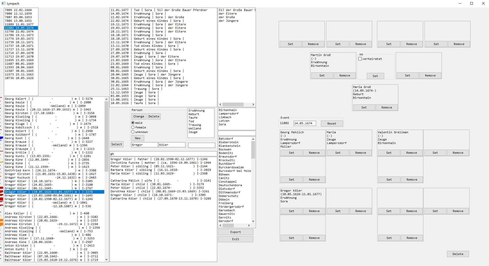

### Der Ort
-Limbach bei Wilsdruff 
-ist gleichzeit der Name des Programm bzw. seine alte Schreibweise "Lÿmpach" 

### Das Programm
-ist erstellt wurden zum schnellen Erfassen der Kirchenbucheinträge von Limbach 
-ist experimentel und nicht ausgereift! 
-läuft out of the Box nur unter Windows 64bit 
### Screenshot

### Die Daten
-bisher erfasste Daten liegen als gedcom-Datei im Ordner "gedcom" 
-diese Daten sind unvollständig und teilweise fehlerhaft 

### Kontakt
tintenfrass@gmx.de
